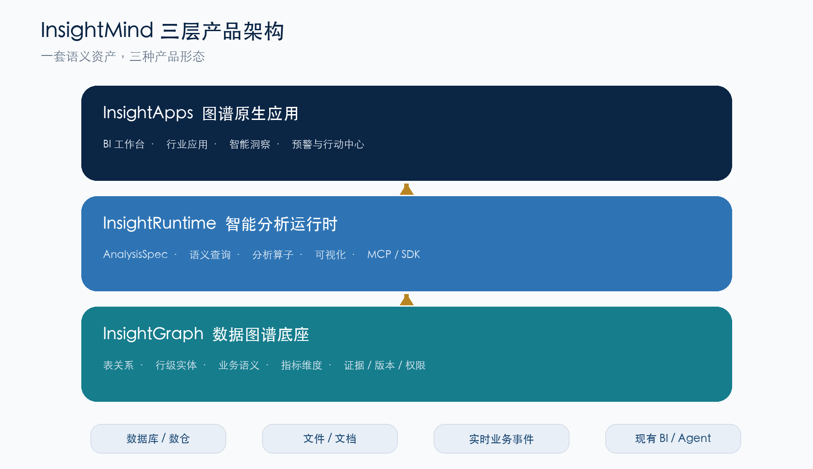
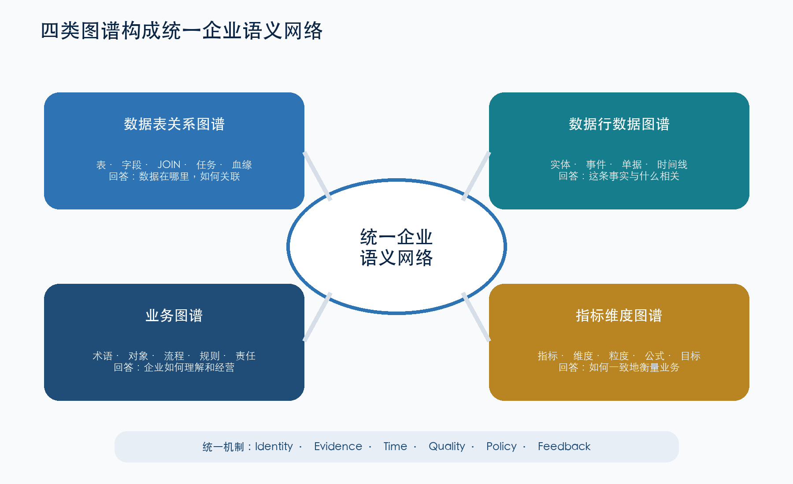
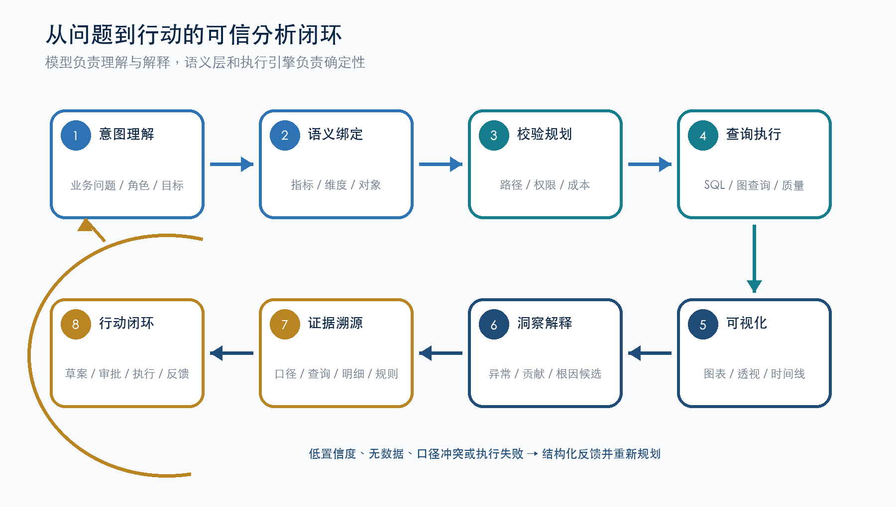

# InsightMind：从知识图谱底座到智能数据应用平台

## 三层产品演进与宣传技术方案

**版本：** V1.0  
**日期：** 2026 年 8 月  
**定位：** 产品战略、技术架构、市场传播与阶段实施一体化方案

> **核心主张：** InsightMind 不是“让大模型直接连库画图”的聊天式 BI，而是以数据图谱和指标语义层为可信底座，让 Codex、DeepSeek Harness 及其他智能体安全地完成数据查询、分析、可视化、应用生成与行动闭环。

**品牌口号：** 让数据关系可理解，让分析过程可追溯，让业务行动可执行。

<!-- PAGEBREAK -->

## 0. 执行摘要

InsightMind 建议从三个相互递进、共享底座的方向演进：第一层建设面向企业的数据图谱基础服务，把数据表、数据行、业务对象、指标与维度组织成可验证、可版本化的语义网络；第二层把现有图谱、语义查询、SQL 生成、分析和 MCP 能力产品化为智能分析中间件，为 BI、数据应用和各类 Agent 提供统一的数据理解与执行能力；第三层在此基础上形成图谱原生的应用生成平台，既保留筛选、透视、图表、看板、下钻、导出等传统 BI 习惯，又把异常发现、原因解释、溯源证据和行动建议实时嵌入业务流程。

这三个方向不是三个割裂的产品。数据基础服务沉淀“企业事实和语义”，分析中间件把语义变成“可组合的分析能力”，智能应用把分析能力变成“业务场景和行动结果”。三层共同构成 InsightMind 的长期产品形态：**面向 AI 时代的企业数据智能操作层**。

| 产品层 | 对外名称建议 | 核心交付 | 直接价值 |
| --- | --- | --- | --- |
| 数据基础服务 | InsightGraph 数据图谱底座 | 四类图谱、语义目录、血缘与治理 API | 统一数据关系、业务含义和指标口径 |
| 分析中间件 | InsightRuntime 智能分析运行时 | 语义查询、分析编排、可视化、MCP/SDK | 让人和 Agent 在可信边界内快速分析 |
| 智能应用平台 | InsightApps 图谱原生应用平台 | BI 工作台、行业应用、预警与行动闭环 | 从“看数据”升级为“解释并推动行动” |

### 一句话定位

**InsightMind 把企业数据库翻译成 Agent 可以理解、查询、验证和持续复用的数据语言，再用这套语言快速生成可信的数据分析平台与业务应用。**

### 为什么现在值得做

Codex、DeepSeek Harness 等智能开发和执行工具正在显著降低页面、接口、SQL 与应用编排的成本，但企业的数据口径、关联关系、权限边界和结果责任并没有因此自动解决。未来的差异化不在于“是否接入大模型”，而在于是否拥有一套可沉淀、可验证、可治理的数据上下文。InsightMind 当前已经具备数据源图谱、业务/指标图谱、语义查询、DA SQL 生成、NLQ、下钻、仪表盘、分析、预警和 MCP Gateway 等基础能力，正适合从项目能力升级为分层、标准化、可商业化的平台。

## 1. 战略定位：从工具集合走向三层数据智能平台

### 1.1 市场问题已经从“有没有图表”转向“能不能对结果负责”

传统 BI 的优势是稳定、可管理和符合用户习惯，但其建模、开发与迭代周期较长；Text-to-SQL 和聊天式 BI 速度快，却容易把指标定义、JOIN 路径和权限控制临时塞进提示词；通用 Agent 能快速生成应用，但如果直接面对原始数据库，仍然会出现口径漂移、错误关联、结果不可复现和资产无法沉淀。

InsightMind 的战略机会是把“确定性”和“变化速度”分层：

- 图谱与语义层负责稳定的事实、关系、口径、权限和验证；
- 分析运行时负责把自然语言、结构化意图和业务上下文编译成可执行分析；
- Codex、DeepSeek Harness 等 Agent 负责快速变化的页面、组件、流程和场景适配；
- 业务人员负责确认关键口径、判断重要异常并审批高风险行动。

### 1.2 三个方向的关系

三层之间形成清晰的依赖关系：没有第一层，第二层会退化为不稳定的 Text-to-SQL；没有第二层，第三层会变成每个应用重复造轮子；没有第三层，前两层难以直接体现业务成果。产品建设应坚持“底座可独立销售、中间件可广泛嵌入、应用层形成行业价值”的组合策略。

### 1.3 对外传播应避免的误区

- 不把产品描述成“又一个知识图谱项目”。图谱是底层技术，业务购买的是更快接数、更准分析、更深溯源和更短行动链路。
- 不承诺“大模型自动理解一切”。应强调自动发现、证据评分、真实查询验证和人工确认共同构成可信机制。
- 不宣称“完全替代 BI”。更准确的说法是保留 BI 的成熟交互，同时把图谱推理、Agent 开发和分析闭环加入其中。
- 不让 Agent 裸连生产数据库。Agent 应通过语义工具、查询预算、权限策略和审计链路访问数据。

## 2. 方向一：数据基础服务——构建企业可计算的数据语义网络

### 2.1 产品目标

数据基础服务的目标不是简单生成一份静态图谱文件，而是形成一套持续运行的“企业数据语义控制面”：能够发现数据资产和关系，管理业务对象与指标口径，记录证据、版本和质量状态，并通过稳定 API 为分析、治理、应用和 Agent 提供上下文。

这一层应围绕四类图谱建设，并通过统一身份、统一证据和统一版本体系互相连接。

### 2.2 数据表关系图谱：回答“数据在哪里、如何关联”

数据表关系图谱以数据库、Schema、表、字段、主键、外键、索引、视图、任务和数据源为核心节点，描述物理结构及其依赖。InsightMind 当前 AD 已经能够解析 MySQL、SQL Server、Oracle、SQLite 等关系型数据源的表结构、字段、注释、样本和显式外键，并通过字段命名、注释引用、枚举值对齐、包含依赖和语义相似度发现隐式关系。

建议在现有能力上继续产品化：

- 为每条关系保存来源、证据类型、置信度、发现时间、确认状态和适用版本；
- 纳入视图 SQL、ETL/ELT 任务、报表查询和应用代码中的真实 JOIN，形成“声明关系 + 使用关系 + 推断关系”；
- 建立 Schema 变更事件和影响分析，回答某张表或字段变化会影响哪些指标、查询、看板与应用；
- 引入关系验证任务，通过抽样 JOIN、基数判断、孤儿率和时间窗口检查关系是否仍然有效；
- 形成可搜索的数据目录、关系浏览器和图谱差异对比能力。

该图谱的直接交付包括数据资产目录、JOIN 路径服务、影响分析服务、关系质量报告和面向 Agent 的数据源上下文。

### 2.3 数据行数据图谱：回答“这条业务事实与什么相关”

数据行图谱面向客户、订单、合同、设备、门店、通话、工单、支付、事件等具体业务实例，支持跨表、跨库和跨系统的实体关联与事件追踪。它是单据溯源、客户 360、异常传播、事件链分析和行动闭环的重要基础。

这一能力不宜采用“把所有数据库行完整复制为 RDF 三元组”的简单方案。更可行的是虚实结合的行级图谱架构：

- **源数据仍留在数据库、数仓或湖仓。** 图谱保存稳定实体 ID、关系索引、时间有效性、来源定位和必要摘要；
- **热点子图按需物化。** 对高价值、关系复杂或需要低延迟追踪的实体和事件，物化属性与邻接关系；
- **冷数据采用虚拟图谱。** 查询时根据映射规则回源获取明细，避免重复存储和大规模同步；
- **实体解析独立服务化。** 通过业务主键、组合键、别名、手机号/证件号脱敏标识、时间窗口和相似度完成跨系统对齐；
- **所有边带证据。** 记录关系由外键、规则、模型、用户确认还是实际业务事件产生，并保存置信度与有效期；
- **默认最小化敏感信息。** 图谱中优先保存引用、哈希标识与授权摘要，明细访问继续受源系统行列权限控制。

行级图谱应重点支持五类查询：实体邻域、事件时间线、因果/影响路径、同源聚合和从指标异常下钻到证据明细。它不只是“看关系”，而是为后续分析提供可核验的事实链。

### 2.4 业务图谱：回答“企业如何理解和经营这些数据”

业务图谱把技术资产映射为业务对象、流程、规则、组织、产品、客户旅程和管理责任。例如“回款”属于哪个业务过程、由哪些单据和状态构成；“重点客户”采用什么分层规则；“门店服务质量”与哪些行为、话术、投诉和经营结果相关。

建议把业务图谱建设为技术图谱与指标图谱之间的桥梁：

- 管理业务术语、同义词、缩写、上下位关系和适用组织；
- 描述业务对象、生命周期状态、流程节点、角色和责任人；
- 关联制度、SOP、合同条款、知识文档和规则版本；
- 把业务概念映射到物理表字段、行级实体和指标维度；
- 支持行业知识包，使零售、客服、制造、供应链等场景可以复用基础本体与分析模板。

业务图谱的核心价值是让“数据库语言”变成“企业语言”，并让自然语言问数、异常解释和应用生成共享同一套业务上下文。

### 2.5 指标维度图谱：回答“如何一致地衡量业务”

指标维度图谱是 InsightMind 当前最接近产品化的优势能力。它需要完整表达指标、维度、事实表、统计粒度、公式、过滤规则、时间口径、可拆解关系、层级、同环比、依赖指标和数据质量状态。

在现有 AD 业务图谱生成与 DA 图谱查询/SQL 生成基础上，建议增加：

- 指标与维度的版本、所有者、认证状态、适用组织和生效区间；
- 指标粒度、可加性、半可加性、去重规则、时区和迟到数据处理方式；
- “指标 × 维度 × 过滤 × 时间粒度”兼容性矩阵与真实查询验证记录；
- 派生指标依赖图、变更影响和循环依赖检查；
- 指标结果与查询计划的可复现快照；
- 业务目标、阈值、预警规则和行动策略的关联。

指标图谱不是指标字典，而是可被查询规划器执行的语义合约。相同指标无论由看板、API、Agent 还是行业应用调用，都应得到一致口径。

### 2.6 四图统一的数据模型

四类图谱应共享以下基础机制：

- **全局身份：** 数据源、表、字段、业务对象、实体、指标和维度都具有稳定 URI/ID，并支持别名与历史 ID 映射；
- **证据模型：** 每个推断结论都能说明来自约束、代码、查询日志、样本、规则、LLM 还是人工确认；
- **时态模型：** 节点和关系具有发现时间、生效时间、失效时间与版本，支持“当时为什么得到这个结果”；
- **质量模型：** 完整性、唯一性、关联成功率、查询成功率、数据新鲜度和异常状态进入同一质量框架；
- **权限模型：** 图谱可见性与源数据权限联动，不因图谱化绕过租户、组织、行列和敏感字段策略；
- **反馈模型：** 用户确认、查询失败、误报、应用使用和行动结果反向更新关系置信度与推荐策略。

### 2.7 数据基础服务的产品形态

建议以“控制台 + API/SDK + 图谱存储适配层”交付：控制台面向数据工程师和治理人员，API/SDK 面向 BI、应用和 Agent，存储层保持可插拔。现有 RDFlib/Jena 与 Turtle 文件链路可继续承担本体、指标语义和中小规模图谱；大规模行级关系可以按客户规模接入专用图数据库、搜索引擎或湖仓索引，但上层统一使用 InsightMind Graph API。

核心服务建议包括 Graph Registry、Metadata Ingestion、Entity Resolution、Evidence & Quality、Lineage & Impact、Semantic Catalog、Graph Query 和 Version & Approval。

## 3. 方向二：智能分析中间件——让人和 Agent 在可信边界内完成分析

### 3.1 产品角色

智能分析中间件位于数据图谱与最终应用之间。它不强制用户采用某一种前端，也不绑定某一个大模型，而是提供一套可嵌入、可组合、可审计的数据分析运行时。传统 BI、企业门户、行业 SaaS、Notebook、Codex、DeepSeek Harness 和其他 MCP 客户端都可以调用同一套能力。

其核心目标是把“用户问题”编译为一个结构化、可验证的分析计划，而不是直接让模型自由生成 SQL。

### 3.2 分析意图编译：从自然语言到 AnalysisSpec

建议定义平台级中间表示 `AnalysisSpec`，作为自然语言、BI 交互、Agent 调用与底层执行之间的稳定协议。它至少包括：

- 业务问题与分析目标；
- 已绑定的指标、维度、时间范围、过滤条件和统计粒度；
- 使用的业务概念、实体范围和图谱路径；
- 排序、TopN、对比基线、异常检测和归因策略；
- 允许的数据源、查询预算、权限上下文与脱敏规则；
- 期望输出的表格、图表、结论、证据和行动草案；
- 每一步解析置信度、候选项和需要人工确认的歧义。

`AnalysisSpec` 使不同模型和不同前端可以复用相同执行链路，也便于保存、比较、测试和重放分析。模型可以更换，语义合约和分析资产不随模型消失。

### 3.3 标准分析闭环

建议运行时按照八步处理：意图理解、语义绑定、关系与权限校验、查询规划、执行与质量检查、可视化、洞察解释、行动草拟。任一步出现低置信度、无数据、口径冲突或权限不足，都应返回结构化状态，而不是由模型用自然语言掩盖失败。

### 3.4 中间件核心模块

**语义检索与消歧。** 综合业务词典、指标维度图谱、数据样本、用户角色和历史分析，找到候选指标与维度；对“销售额”“有效客户”等多口径概念显示差异并要求确认。

**图谱查询与路径规划。** 查找物理 JOIN 路径、业务对象关系、指标可拆解维度和行级证据路径，并把路径质量、基数风险和历史成功率纳入规划。

**语义 SQL/DSL 执行。** 复用 DA 对指标、维度、过滤、下钻、复杂指标和 LAX/XLax DSL 的处理能力，将确定的语义请求转换为查询计划与 SQL。执行前进行只读检查、成本限制、超时和返回行数控制。

**统计与诊断分析。** 提供趋势、结构、贡献度、异常检测、相关性、分群、对比、漏斗、队列和根因候选等标准算子。LLM 负责选择与解释，数值计算由确定性分析服务完成。

**可视化编译。** 根据数据类型、分析目标和业务模板生成 `VisualizationSpec`，支持表格、指标卡、折线、柱状、散点、热力、漏斗、桑基、关系图和时间线。图表必须携带指标口径、过滤条件、数据时间和溯源入口。

**证据与解释。** 每个结论关联指标定义、查询计划、SQL 摘要、数据时间、质量状态、贡献维度、样本明细和图谱路径。用户可以从结论回到图表、从图表回到查询、从查询回到表字段和业务规则。

**资产沉淀。** 将一次分析保存为可复用的 AnalysisSpec、查询组件、图表、看板、下钻路径、预警规则或应用模块，并支持版本、测试和审批。

### 3.5 面向 Codex 与 DeepSeek Harness 的工具化能力

InsightMind 当前 MCP Gateway 已经以只读方式暴露健康检查、语义元数据、目录搜索、图谱摘要、表列表、JOIN 路径、影响分析、兼容维度、NLQ、语义查询、SQL 审查、指标推理和 DSL 等 21 个工具。这可以作为分析中间件 Agent 接入层的起点。

下一步建议把工具按能力域标准化：

- **Discover：** 搜索指标、维度、业务对象、数据集和已有分析资产；
- **Plan：** 解析问题、生成 AnalysisSpec、评估候选路径和查询成本；
- **Query：** 执行语义查询、图查询、行级溯源和受控明细查询；
- **Analyze：** 调用统计分析、异常检测、贡献分解和解释服务；
- **Visualize：** 生成或更新图表、组件与看板规范；
- **Persist：** 在预览、差异比较、审批和审计控制下保存资产；
- **Act：** 生成行动草案，经过策略校验和人工审批后连接外部业务系统。

工具返回值应包含结果、语义说明、证据、质量、权限裁剪、执行追踪和可重试建议，避免只返回一块难以判断可靠性的 JSON 数据。

### 3.6 中间件的典型使用方式

- 数据分析师在现有 BI 中调用语义 API，不再重复编写易漂移的 JOIN 和指标 SQL；
- Codex 根据自然语言需求发现指标、生成专题分析页面，并把新组件保存回 InsightMind；
- DeepSeek Harness 编排跨多步的数据调查，调用图谱查路径、调用查询引擎取数、调用分析算子做归因；
- 行业 SaaS 在自己的界面中嵌入指标卡、下钻、异常解释和数据溯源；
- 数据治理团队利用同一图谱做影响分析、关系验证和指标认证。

### 3.7 这一层的商业价值

分析中间件将 InsightMind 从一个完整产品扩展为企业数据智能的公共能力层。客户可以保留原有数据库、数仓、BI 和模型选择，只在关键链路引入 InsightMind，因此部署阻力更小；合作伙伴可以在统一 API 上开发行业应用；模型升级时，上层应用无需重写数据语义和查询执行逻辑。

## 4. 方向三：图谱原生智能应用——保留 BI 习惯，升级为实时洞察与行动

### 4.1 产品目标

第三层直接面向业务用户。它不是把传统 BI 全部推翻，而是在用户熟悉的工作方式上叠加图谱驱动的上下文和智能能力。用户仍然可以选择指标、拖拽维度、设置筛选、查看图表、制作看板、下钻明细、导出和订阅；同时，系统会主动提示异常、推荐下一步分析、解释可能原因、展示溯源证据，并将确认后的结论转化为行动方案。

### 4.2 双层交互：稳定工作台 + 智能分析层

**稳定工作台**承载企业级 BI 的确定性体验：指标卡、查询表格、透视分析、图表编辑、仪表盘布局、联动筛选、层级下钻、权限、分享、订阅与导出。

**智能分析层**以可关闭、可解释、可追踪的方式嵌入：

- 图谱推荐可分析维度和相关指标，而不是只展示字段列表；
- 总指标平稳时，主动发现被汇总掩盖的区域、产品、客户或流程异常；
- 对异常给出贡献度、时间线、关联事件、行级证据和可信度；
- 根据业务角色生成不同解释：管理者看影响与建议，分析师看方法与证据，执行人员看对象清单与下一步；
- 把一次分析沉淀为监控规则、处理清单、行动草案和复盘任务。

### 4.3 应用生成机制：从页面代码生成升级为受控蓝图生成

直接让 Agent 自由生成页面可以很快，但难以长期治理。建议定义 `AppManifest` 或“应用蓝图”，声明：应用目标、用户角色、页面、组件、指标、维度、过滤器、图谱路径、分析策略、预警规则、行动连接器、权限和验收测试。

Codex 或其他 Agent 根据蓝图选择经过认证的组件和能力，生成前端、接口适配与场景逻辑；运行时仍由 InsightMind 提供语义查询、权限、追踪和分析能力。这样既保留 Agent 的开发速度，也让应用具备可升级、可审计和可复用的结构。

建议形成以下资产层级：

- **原子组件：** 指标卡、趋势图、透视表、关系图、时间线、明细抽屉、证据面板；
- **分析模块：** 趋势诊断、结构贡献、漏斗转化、客户 360、单据溯源、异常复盘；
- **场景模板：** 销售经营、门店管理、客服质量、供应链履约、财务回款、设备运维；
- **完整应用：** 由行业图谱包、AppManifest、页面主题、权限包和验收测试组合而成。

### 4.4 从预警到行动的闭环

实时或准实时能力应通过事件化架构逐步实现。数据变更、指标刷新、规则命中和模型检测形成事件；系统定位受影响指标与业务对象，运行受控分析链路，给出异常摘要、证据和行动草案；高风险动作必须经过人工审批，执行结果再回写图谱用于复盘。

完整闭环可以概括为：**监测 → 发现 → 定位 → 解释 → 建议 → 审批 → 执行 → 反馈**。

行动并不等于让模型直接修改生产系统。建议将行动分级：

- L0 信息提示：生成说明、标注异常、推荐下钻；
- L1 分析资产：保存查询、创建看板、订阅报告；
- L2 业务草案：生成工单、客户清单、沟通话术或策略草稿；
- L3 受控执行：在审批、幂等、权限和审计下调用 CRM、工单、营销或协同系统；
- L4 自动化策略：仅对规则明确、风险低、可回滚的场景开放，并持续评估效果。

### 4.5 首批行业应用建议

**客服与通话质量。** 复用当前呼叫质量示例，将接通率、SOP 执行、问题标签、客户反馈、录音/文本证据、门店和员工组织关系连接起来，形成“监控—诊断—辅导—复盘”工作台。

**门店经营。** 关注销售、客流、转化、客单、商品结构、人员排班、活动和客户事件，自动发现总盘稳定下的门店分化，并生成店长行动清单。

**销售与客户经营。** 将线索、商机、合同、回款、客户互动和组织责任连接起来，支持漏斗诊断、停滞商机识别、重点客户风险和下一步跟进建议。

**供应链与履约。** 连接订单、库存、采购、物流、供应商和异常事件，支持缺货影响、延期传播、责任路径和替代策略分析。

选择首批场景时应优先考虑：数据链路可获得、业务对象明确、指标有频繁决策价值、异常能形成行动、当前仓库已有能力可复用。客服质量和门店经营最适合作为第一批宣传 Demo。

## 5. 三层协同形成的数据智能飞轮

三层产品共享同一套语义资产和反馈链路。新接入的数据丰富数据表关系图谱；用户分析和真实查询验证关系与指标；应用使用记录沉淀高价值分析路径；预警处理和行动结果反向校正业务规则、阈值和推荐策略。

飞轮的关键不是训练一个专有大模型，而是积累企业自己的“可执行上下文”：数据关系、指标口径、查询验证、分析路径、场景模板和行动反馈。模型可以替换，前端可以重做，这些资产会持续增值。

> **长期壁垒：** 不是模型调用次数，也不是图表数量，而是企业数据语义、证据链、验证案例和业务反馈共同形成的可执行知识资产。

## 6. 总体技术架构建议

### 6.1 分层架构

建议采用控制面与数据面分离、图谱与源数据分离、模型推理与确定性执行分离的架构。

| 层级 | 主要组件 | 当前可复用基础 | 重点演进 |
| --- | --- | --- | --- |
| 接入层 | JDBC/SQLAlchemy、元数据采集、文件/文档、CDC、查询日志 | AD 多数据库连接器、Schema 解析、采样 | CDC、任务/代码血缘、连接器规范 |
| 图谱控制面 | Graph Registry、本体、实体解析、证据、版本、质量、审批 | RDFlib、Turtle、关系发现、业务图谱构建 | 四图统一、时态与证据、服务化存储 |
| 语义执行面 | 指标解析、路径规划、SQL/DSL、查询治理、缓存 | DA/Jena、指标服务、动态数据源、AD 语义 API | AnalysisSpec、成本治理、跨源联邦 |
| 分析运行时 | 统计算子、洞察、可视化、溯源、资产管理 | NLQ、Pivot、Insight、Stats、Alerts、Dashboard | 标准算子协议、证据包、可重放分析 |
| Agent 接入层 | MCP、REST、SDK、事件、审批工具 | 只读 MCP Gateway 21 tools | 工具分域、受控写入、策略与审计 |
| 应用层 | BI 工作台、行业模板、App Studio、行动中心 | Ad-Hoc、看板、下钻、预警示例 | AppManifest、组件市场、行动连接器 |

### 6.2 存储策略

本体、指标维度、业务术语和中小规模关系可以继续使用 RDF/OWL 模型，以 SPARQL 支持灵活语义查询；物理元数据和图谱注册信息需要可事务化的元数据库；大规模行级图谱采用可插拔图存储或湖仓索引；查询结果、分析资产和事件分别进入缓存、对象存储与事件系统。任何存储选型都不应改变上层 Graph API、Semantic API 和 AnalysisSpec 协议。

### 6.3 查询与推理策略

平台需要组合三类能力，而不是把所有问题交给一种引擎：

- SPARQL/图查询处理语义关系、血缘、兼容性和路径；
- SQL/OLAP 引擎处理大规模聚合和明细取数；
- 确定性分析算子处理统计与诊断；
- LLM 处理意图理解、候选规划、解释和应用代码生成。

模型输出必须先落到 AnalysisSpec、AppManifest 或图谱变更草案等结构化协议，再经过规则、权限、验证和必要审批执行。

### 6.4 事件与实时能力

“实时”应分级定义：元数据变更可分钟级发现；指标刷新根据业务需要支持分钟级或小时级；高频事件通过 CDC/消息总线触发增量计算；复杂根因分析可以异步完成。产品界面需要显示数据时间、分析时间和新鲜度，避免把离线结果包装成实时结论。

## 7. 安全、治理与可信机制

### 7.1 安全原则

- Agent 默认只读，通过 MCP/语义 API 访问，不直接获得生产数据库通用凭据；
- 身份、租户、角色、指标、维度、行、列和敏感等级策略贯穿图谱与查询执行；
- 查询执行设置数据源白名单、SQL 类型限制、超时、扫描预算、行数上限和并发配额；
- 敏感字段优先在源端脱敏，图谱只保留最小必要标识和授权摘要；
- 受控写入必须包含预览、差异、审批、幂等、回滚和审计；
- LLM 请求不携带无关凭据和大批敏感明细，支持私有模型或企业网关。

### 7.2 可信分析的证据包

每次重要分析应生成可下载或可追踪的 Evidence Pack，包括问题、AnalysisSpec、指标版本、维度与过滤、图谱路径、查询计划、SQL 指纹、数据时间、质量状态、分析方法、结论、置信度和人工修改记录。它是内部审计、争议复核、模型评估和结果复现的共同基础。

### 7.3 图谱变更治理

自动发现或 LLM 推断的关系不能直接等同于认证事实。建议使用“发现—验证—评审—发布—监控—退役”的生命周期。高风险指标和关键业务关系需要双人审批或负责人认证；低风险候选可以在沙箱中供探索使用，但必须显示状态和置信度。

## 8. 产品指标与验收体系

平台不能只用页面数量或模型回答次数衡量。建议建立四组指标：

**底座质量。** 数据源覆盖率、关系证据覆盖率、实体解析准确率、指标认证率、血缘覆盖率、图谱新鲜度和变更发现时延。

**查询可靠性。** 指标口径一致率、指标维度组合验证通过率、语义绑定准确率、查询成功率、无数据识别率、结果可复现率和权限违规拦截率。

**交付效率。** 新数据源接入周期、新指标上线周期、从需求到首版应用时间、组件复用率、Agent 自动完成率和人工修改量。

**业务结果。** 异常提前发现时间、根因定位时长、预警有效率、行动采纳率、闭环完成率和关键业务指标改善。

> **建议的北极星指标：** 每月由 InsightMind 驱动、具备完整证据链并被业务实际采纳的分析与行动闭环数量。

## 9. 分阶段路线图

### 阶段 A：0—3 个月，固化当前优势，形成统一产品骨架

- 梳理当前 AD、DA、MCP、NLQ、Pivot、Insight、Alerts、Dashboard 能力，建立统一 API 和版本说明；
- 发布 Graph Registry、统一实体 ID、证据模型和指标版本的最小规范；
- 定义 AnalysisSpec V1 与工具返回的 Evidence Envelope；
- 完成现有业务图谱的验证报告、变更差异和一键演示环境；
- 以客服质量/门店经营 Demo 打通“看板—异常—下钻—证据—行动草案”。

**阶段结果：** InsightMind 从功能集合变成可以清晰讲解、稳定演示和重复部署的平台原型。

### 阶段 B：3—6 个月，发布数据图谱基础服务与分析运行时 V1

- 服务化数据表关系图谱、指标维度图谱、JOIN 路径和影响分析；
- 增加业务词典、认证状态、图谱版本、质量评分和审批流程；
- 建设 AnalysisSpec 执行器、查询预算、追踪和可重放能力；
- 将 MCP tools 按 Discover/Plan/Query/Analyze/Visualize 分域；
- 提供 Python/TypeScript SDK 和嵌入式图表/证据组件。

**阶段结果：** 数据团队和 Agent 可以通过稳定协议接入 InsightMind，而不依赖特定 UI。

### 阶段 C：6—12 个月，行级图谱与 App Studio V1

- 在一个高价值场景完成虚拟行级图谱、实体解析、时间线和明细溯源；
- 定义 AppManifest、组件注册表、行业场景模板和验收测试规范；
- 支持 Codex/DeepSeek Harness 生成页面、分析模块和看板并进行差异预览；
- 建设预警中心、行动草案、审批和反馈回写；
- 形成客服质量、门店经营两个可复制行业方案。

**阶段结果：** 从“提供分析能力”升级为“快速生成可运行的业务应用”。

### 阶段 D：12—18 个月，实时化、生态化与企业级规模

- 接入 CDC/事件总线，支持图谱、指标和预警的增量更新；
- 扩展专用图存储、跨源查询、缓存和多租户隔离；
- 建设连接器、组件、行业图谱包和行动策略市场；
- 完善 SSO、细粒度权限、审计、成本治理、灾备与可观测性；
- 通过合作伙伴扩展更多行业应用。

**阶段结果：** 形成数据图谱底座、智能分析中间件和行业应用生态的完整商业平台。

## 10. 商业包装与目标客户

### 10.1 产品版本建议

**InsightGraph Foundation。** 面向数据平台、治理和 BI 团队，按数据源、图谱规模和企业功能授权，交付数据关系、指标语义、目录、血缘和质量能力。

**InsightRuntime for Agents。** 面向 AI 平台和应用研发团队，按运行环境、调用量或开发席位授权，交付语义查询、分析、可视化、MCP 与 SDK。

**InsightApps / Industry Edition。** 面向业务部门和行业客户，按场景、用户或部署授权，交付完整应用、行业图谱包、预警策略和行动闭环。

三种版本可以独立进入客户，也能逐层扩展。开源社区版可保留核心图谱构建、单机语义查询和本地 Agent 接入；企业版重点提供治理、权限、规模化、协作、审计和行业能力。

### 10.2 核心客户画像

- 已有数据库/数仓和 BI，但指标口径分散、迭代慢的中大型企业；
- 正在建设企业 Agent 平台，但缺少可信数据工具和语义上下文的 AI 团队；
- 需要在客户环境快速交付数据应用的行业软件商与解决方案商；
- 希望将数据治理成果直接转化为分析和业务价值的数据平台主管部门。

## 11. 宣传传播方案

### 11.1 核心传播主题

主标题建议：**让 Agent 负责变化，让图谱负责确定性。**

副标题建议：**InsightMind 将企业数据关系、业务语义和指标口径组织为可执行图谱，让 Codex 与各类智能体在可信边界内完成查询、分析、可视化、应用生成和行动闭环。**

备选口号：

- 让 Codex 搭平台，让语义层守口径，让数据自己说话；
- 从数据库到业务行动，只差一层可执行图谱；
- 不让大模型猜数据，让每一次分析都有口径、有证据、有下一步；
- 保留 BI 的熟悉体验，加入图谱驱动的实时洞察。

### 11.2 30 秒电梯介绍

InsightMind 是一套面向 AI 时代的数据智能平台。它先自动发现企业数据库中的表、字段和关联关系，构建业务与指标语义图谱，再把这些能力通过语义查询、分析 API 和 MCP 工具提供给 Codex、DeepSeek Harness 以及现有 BI。这样，Agent 不需要每次从零猜测指标口径和 JOIN，就能快速生成可追溯、可验证的数据分析和完整应用。用户保留熟悉的看板、透视和下钻体验，同时获得异常发现、原因解释、证据溯源和行动建议。

### 11.3 三分钟产品故事

企业已经有很多数据库和报表，但数据关系没有被系统表达，指标口径散落在 SQL、文档和人的经验里。大模型虽然会写 SQL、画图和生成页面，却无法天然知道哪个销售额才是公司口径、订单如何正确关联客户、一个异常能否追溯到具体业务对象。

InsightMind 先连接现有数据源，自动盘点表字段、发现显式与隐式关系，并构建指标、维度和业务对象图谱；随后通过真实查询验证指标和维度组合，把不确定性暴露出来并持续修复。上层的分析运行时把这些能力开放给 BI、应用和各类 Agent。用户提出问题后，系统先绑定经过认证的指标和关系，再生成查询、图表与分析，所有结论都可以回到口径、SQL、源表和明细证据。

在最终应用里，业务人员仍然使用熟悉的看板和下钻操作，但系统会主动发现汇总指标下被掩盖的异常，解释哪些地区、产品、客户或流程造成变化，并生成行动草案。Codex 则可以基于同一语义底座快速增加页面、指标和行业流程，而不是重新理解数据库。InsightMind 因此把“AI 生成速度”和“企业数据确定性”组合在一起。

### 11.4 官网或宣传册结构

1. 首屏：一句定位、三层架构图和“观看可信分析闭环”按钮；
2. 痛点：传统 BI 迭代慢，裸连数据库的 Agent 不可靠；
3. 三层产品：InsightGraph、InsightRuntime、InsightApps；
4. 核心 Demo：一个异常如何从指标到维度、事件、明细和行动；
5. Agent 集成：展示 Codex/MCP 调用经过治理的工具，而不是数据库凭据；
6. 可信机制：统一口径、查询验证、证据包、权限和审计；
7. 行业场景：客服质量、门店经营、销售客户、供应链；
8. 部署方式：本地、私有云、混合部署与开放 API；
9. 行动入口：体验 Demo、接入一个数据源或预约方案沟通。

### 11.5 建议的现场演示脚本

选择“呼叫质量/门店经营”作为 8—10 分钟主 Demo：

1. 展示传统 KPI 看板，总体指标看似稳定；
2. 系统提示某门店或员工群体出现被汇总掩盖的异常；
3. 点击异常，自动执行贡献度分析并推荐关键下钻维度；
4. 查看指标定义、数据时间、查询路径和质量状态；
5. 从指标异常溯源到具体通话、客户、标签或业务事件；
6. 生成针对门店经理的行动草案和待处理对象清单；
7. 切换到 Codex，让其通过 MCP 搜索指标、复用组件并新增一个专题页；
8. 展示新页面仍使用同一指标口径、权限和证据链。

演示的高潮不是“模型写了一段漂亮文字”，而是用户能够从结论一路点回证据，并把分析转成可审批的行动。

### 11.6 面向不同受众的表达

| 受众 | 最关心的问题 | 传播重点 |
| --- | --- | --- |
| 企业管理者 | 能否更早发现问题并推动执行 | 从看板到异常、原因和行动闭环 |
| CIO/CDO | 能否复用现有投资并治理 AI 风险 | 不替换数仓/BI，增加统一语义、权限和审计 |
| 数据团队 | 能否减少重复建模和临时 SQL | 四类图谱、指标合约、验证与影响分析 |
| AI/研发团队 | Agent 如何安全、稳定地使用企业数据 | AnalysisSpec、MCP/SDK、受控工具和证据包 |
| 行业伙伴 | 能否快速复制场景 | 行业图谱包、组件、AppManifest 和开放接口 |

## 12. 差异化竞争定位

| 方案类型 | 优势 | 典型局限 | InsightMind 的差异 |
| --- | --- | --- | --- |
| 传统 BI | 交互成熟、管理稳定 | 建模和场景迭代慢，分析多停留在展示 | 保留 BI 习惯，加入图谱、Agent 和行动闭环 |
| 聊天式 BI / Text-to-SQL | 上手快、探索自然 | 口径和 JOIN 易漂移，难沉淀与审计 | 先绑定认证语义，再规划和执行查询 |
| 数据目录/治理平台 | 元数据与流程完整 | 与业务分析和应用执行距离较远 | 图谱直接驱动查询、分析、可视化和应用 |
| 通用 Agent 应用生成 | 页面和代码交付快 | 缺少企业数据确定性与运行治理 | Agent 生成应用，InsightMind 提供可信运行时 |
| 单一图数据库方案 | 关系查询能力强 | 不能自然替代数仓聚合、指标和 BI | 图查询、SQL/OLAP、分析算子和 LLM 分工协同 |

核心竞争壁垒应围绕四点持续强化：跨层语义图谱、真实查询验证、Agent 工具协议、从洞察到行动的反馈闭环。

## 13. 组织与交付建议

建议按产品能力而不是按 AD/DA 技术栈组织演进：

- Graph Foundation 小组负责连接器、四图统一模型、实体解析、血缘、质量和图谱服务；
- Semantic Runtime 小组负责 AnalysisSpec、指标执行、SQL/DSL、查询治理、分析算子和证据；
- Agent & App 小组负责 MCP/SDK、组件、AppManifest、应用生成、预警和行动中心；
- Industry Solution 小组负责行业本体、场景模板、Demo、客户验证和价值指标；
- Platform Engineering 负责权限、审计、多租户、部署、可观测性和性能。

每个阶段都应以端到端场景验收，而不是只验收单个模块。例如“从一个新数据源接入，到指标认证，再到 Agent 生成看板并完成一次有证据的异常闭环”。

## 14. 主要风险与应对

**范围过大。** 四类图谱、分析中间件和应用平台容易同时铺开。应以指标维度图谱和现有 Demo 为主线，行级图谱先做单场景，应用先做两个行业模板。

**图谱新鲜度不足。** 建立版本、增量采集、变更事件和失效检测，不把一次构建当作永久事实。

**LLM 推断被误认为事实。** 所有推断保存证据和置信度，区分候选、已验证、已认证状态；关键口径必须经过真实查询和人工确认。

**行级图谱规模失控。** 采用虚拟图谱与热点物化，不复制全部明细；按实体、时间和场景建立索引与保留策略。

**应用生成难以维护。** 用 AppManifest、认证组件、自动测试和差异预览约束生成，不把自由代码生成作为唯一资产形式。

**行动建议带来业务风险。** 默认生成草案，高风险动作必须审批；设置权限、幂等、回滚、审计和效果复盘。

**宣传承诺超前。** 所有材料使用“当前已具备 / 下一阶段 / 规划能力”标识，现场演示只展示可重复运行的链路。

## 15. 结论与建议决策

InsightMind 最值得坚持的方向，是成为连接企业数据事实与智能应用之间的“可执行语义层”。数据表关系图谱解决技术关系，数据行图谱连接具体事实，业务图谱表达企业理解，指标维度图谱保证衡量一致；分析中间件把这些知识变成稳定工具，应用平台再将工具变成业务人员熟悉且能够持续演进的工作方式。

建议立即做出三项产品决策：

1. 将“三层一体”确定为统一产品战略，并采用 Graph Foundation、Analysis Runtime、Graph-native Apps 的清晰边界；
2. 以 AnalysisSpec、Evidence Pack、AppManifest 作为未来跨模型、跨前端的三项核心协议资产；
3. 以客服质量/门店经营为首个端到端样板，在 3 个月内完成可重复演示的“图谱—分析—溯源—行动—Agent 改造”闭环。

最终，InsightMind 对外销售的不是一个图谱文件、一个聊天框或一组图表，而是一种新的企业数据生产方式：**让变化快速发生，同时让每一个数据结论仍然有统一口径、可信证据和可执行下一步。**

---

## 附录 A：当前项目能力与演进方向对应关系

- AD 的多数据源连接、Schema 解析、采样、显式/隐式关系发现，可作为数据表关系图谱的基础；
- AD 的业务图谱 ETL/LLM 生成、真实查询验证与修复，可作为业务图谱和指标维度图谱的基础；
- DA 的 Jena GraphStore、SPARQL 指标服务、动态数据源、SQL 生成、复杂指标与 DSL，可作为语义执行面的基础；
- AD 的 NLQ、Ad-Hoc、Pivot、Stats、Insight、Dashboard 和 Alerts，可沉淀为分析运行时与应用组件；
- 只读 MCP Gateway 的 21 个 tools，可作为 Codex、DeepSeek Harness 和其他 Agent 的标准接入起点；
- 当前呼叫质量与门店相关 Demo，可作为图谱原生行业应用的首个宣传样板。

## 附录 B：建议优先定义的三个协议

**AnalysisSpec：** 描述要分析什么、使用哪些认证语义、如何执行、需要何种输出以及有哪些约束。

**Evidence Pack：** 描述结论如何产生、使用了什么口径和数据、质量如何、能否复现、谁做过修改。

**AppManifest：** 描述一个数据应用的角色、页面、组件、语义依赖、分析策略、预警、行动、权限和验收测试。
