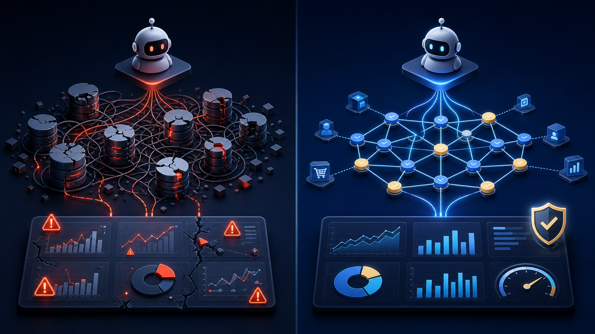

# Codex 时代，数据分析平台为什么不能只靠大模型画看板

> 当页面、接口和 SQL 都可以由 Agent 快速生成，数据分析平台真正稀缺的能力，不再是“把图画出来”，而是让每一张图都建立在可信、统一、可以持续运行的数据语义之上。

## 先说结论

这篇文章讨论的不是“大模型能不能生成图表”，而是一个更接近生产环境的问题：**当图表和页面的生成成本快速下降后，企业如何保证不同 Agent、不同看板和不同时间得到的指标仍然口径一致、关系正确、结果可验证？**

核心判断有四点：

- 大模型降低了页面、接口和 SQL 的实现成本，但没有降低业务事实的管理成本；
- 直接连接数据库适合探索和 Demo，不等于具备生产级分析能力；
- 指标语义、数据关系、权限和验证机制，应该成为 Agent 可以复用的稳定基础设施；
- 最有价值的架构不是“AI 替代 BI”，而是让 Agent 负责快速变化，让语义层负责确定性。

过去搭建一个数据分析平台，往往意味着漫长的需求沟通、数据建模、接口开发和看板制作。业务人员提出问题，分析师理解口径，工程师寻找数据表，开发人员实现查询和页面。等看板真正上线，业务问题可能已经发生了变化。

Codex 一类编程 Agent 正在改变这个过程。它可以阅读代码、理解项目、生成接口、修改页面、编写 SQL，也可以根据反馈连续迭代。一个过去需要多人协作完成的专题分析，现在有机会在更短的链路中完成。

于是，一个很自然的想法出现了：既然大模型会写 SQL、会画图，是否只要让它连接数据库，就能自动生成数据看板？

答案是：可以很快做出 Demo，但距离一个真正可用的数据分析平台，还有一层关键基础设施。

## 直接生成看板，最难的不是画图

假设业务人员问：“上周哪个渠道的退款率最高？”

对于人来说，这句话已经足够自然；对于数据库来说，其中几乎每个词都需要定义：退款以申请时间还是完成时间为准？退款率的分母是支付订单、完成订单还是商品件数？渠道取下单渠道还是归因渠道？跨周完成的退款应该算在哪一天？测试订单和取消订单是否排除？

如果这些信息没有明确写入上下文，大模型只能根据表名、字段名和少量样例进行推测。它也许能够生成语法正确的 SQL，却不一定生成业务正确的 SQL。

这正是“直接让大模型分析数据库”的根本问题：模型擅长理解意图和生成方案，但数据库中的字段并不会自动携带完整业务含义。

企业数据中还普遍存在另外几类问题：有些表没有声明外键，关联关系藏在命名习惯和历史代码里；同一个指标在不同部门有不同口径；一张事实表可以按时间分析，却未必能正确关联区域或组织维度；数据库结构发生变化后，旧的查询仍然可以执行，但结果已经偏离原意。

这些问题不会因为模型更强而自然消失。模型需要的不是更多原始字段，而是一套清晰、稳定、可验证的数据语言。

*左侧：Agent 直接面对杂乱的数据关系，结果容易随上下文漂移；右侧：Agent 在已验证的语义网络中选择指标和分析路径。*

| 对比维度 | 大模型直接连接数据库 | 通过语义层访问数据 |
| --- | --- | --- |
| 指标口径 | 依赖提示词和临时上下文 | 由统一指标定义约束 |
| 表关联 | 根据字段名和样例推测 | 使用已发现、已确认的关系 |
| 结果稳定性 | 不同对话可能生成不同 SQL | 相同语义请求复用确定性路径 |
| 变更影响 | 表结构变化后难以及时发现偏差 | 可以持续验证“指标 × 维度”组合 |
| 权限与审计 | 容易退化为宽泛的数据库访问 | 在工具和语义边界内执行 |
| 资产沉淀 | 交付一次性回答或临时图表 | 沉淀指标、组件、看板和预警规则 |

## Codex 时代，平台的价值没有消失

Codex 降低的是软件实现成本，而不是事实管理成本。

页面可以重新生成，图表可以随时调整，分析流程也可以快速重构。但指标口径、数据关系、权限边界和查询可靠性仍然需要一个稳定的系统承载。否则，每一次对话都要重新解释业务，每一个 Agent 都可能形成不同理解，每一张看板都可能拥有自己的“销售额”。

因此，Codex 时代的数据分析平台不应该只是一个固定功能越来越多的传统 BI，也不应该只是一个可以对数据库自由提问的聊天框。更合适的形态是：

- 底层保留稳定的数据连接、指标语义、查询执行、权限和验证能力；
- 上层由 Codex 根据行业和业务需求，快速生成页面、组件、分析路径与工作流；
- 人负责确认关键业务口径，Agent 负责完成大量重复实施和持续迭代。

可以把它概括为一句话：**让 Agent 负责变化，让平台负责确定性。**

## InsightMind 想补上的，正是这层确定性

InsightMind 的起点不是让大模型直接猜测数据库，而是先把数据库翻译成业务可以理解、机器也可以使用的语义网络。

AD 知识图谱构建器连接 MySQL、SQL Server、Oracle、SQLite 等关系型数据源，解析表、字段、注释、样本和显式外键，也从字段命名、注释引用、枚举值对齐、包含依赖和语义相似度中发现那些没有写进数据库约束的关系。这一步形成数据源知识图谱，回答“数据在哪里、彼此如何关联”。

在此之上，InsightMind 继续构建业务知识图谱，描述指标、维度、事实表、计算口径和可拆解关系。如果企业已有参考指标平台，可以通过确定性的 ETL 路径导入；如果没有，也可以由 LLM 根据元数据辅助推断，再交给后续流程验证和修复。

DA 指标服务加载业务知识图谱，根据已经确认的指标、维度、过滤条件和下钻路径生成 SQL。这样，大模型不需要在每次提问时从零猜测 JOIN 和公式，而是在明确的语义边界中理解用户意图、选择分析路径。

更重要的是，业务图谱并非“生成完成就算成功”。InsightMind 会用真实查询验证“指标 × 维度”组合是否能够工作，将失败信息反馈给修复流程。数据库提供事实，语义层约束口径，查询引擎负责执行，验证机制负责兜底——这四个部分共同构成了可信分析的基础。

*从底层数据源到上层看板与预警，查询失败和口径问题会回流到语义层，形成持续修复的闭环。*

## 一套可信分析链路，至少要有四层

如果把“自然语言生成看板”拆开来看，一个能够进入生产环境的链路至少包含四层：

1. **事实层**：连接真实数据库，读取表结构、字段、注释、样本和约束，明确数据来自哪里；
2. **语义层**：管理指标、维度、计算公式、关联关系和业务口径，让不同 Agent 使用同一种数据语言；
3. **执行层**：根据明确的语义路径生成并执行 SQL，限制查询边界，记录执行过程；
4. **验证层**：用真实查询检查指标与维度组合，将失败原因反馈给图谱和规则修复流程。

上层的看板、问数、下钻和预警都可以快速变化，但这四层不能在每次对话中临时重建。它们决定了一个系统是在“生成一张看起来合理的图”，还是在“交付一个可以对结果负责的数据产品”。

## Codex 在其中扮演什么角色

在这套架构里，Codex 不只是一个自然语言问数入口，更像数据平台的实施者和持续开发者。

它可以帮助完成环境安装、数据源接入和项目配置；可以阅读现有业务代码和数据库结构，协助补充指标语义；可以根据管理者的关注点生成专题页面、看板组件和监控规则；也可以在需求发生变化时修改分析流程，而不必等待下一轮传统项目排期。

InsightMind 已经通过只读 MCP Gateway，将知识图谱、自然语言查询、语义查询、指标推理和 DSL 查询等能力暴露给 Codex、Claude Code 及其他 MCP 客户端。Agent 获得的不是不受约束的数据库访问，而是一组边界清楚、可以组合的数据分析工具。

未来再加入带有预览、差异比较、审批和审计能力的受控写入工具，Codex 就可以进一步参与指标、组件、看板和预警的创建与维护，同时保留生产系统需要的安全边界。

## 从一次回答，变成持续运行的数据产品

直接使用大模型的典型交付物是一段回答、一条 SQL 或一张临时图表。它们可以帮助探索，却很难自然形成组织长期使用的分析资产。

InsightMind 希望把这条链路继续向前推进：一次自然语言需求可以被沉淀为明确的指标和维度，进一步形成可复用的查询组件、看板、下钻路径和预警规则。当数据变化或业务提出新问题时，Codex 在已有语义层上继续调整，而不是从原始数据库重新开始。

这也意味着，看板不再是项目的终点。看板呈现发生了什么，维度下钻帮助定位问题出现在哪里，知识图谱说明相关数据如何连接，统计分析和监控预警则让系统继续寻找那些尚未被人主动提问的异常。

## 从 Demo 走向生产，可以先检查这 7 个问题

无论使用哪一种大模型或 Agent 框架，都可以用下面的问题判断一个智能分析系统是否真正具备生产价值：

- 同一个指标在不同页面、不同对话中，定义是否完全一致？
- SQL 中的 JOIN 关系来自已确认的模型，还是由大模型临时猜测？
- 指标按某个维度拆解前，系统是否验证过这个组合能够正确查询？
- 数据库字段或表结构变化后，系统能否发现已有分析路径已经失效？
- 用户是否只能访问权限范围内的指标、维度和明细？
- 一次分析结果能否沉淀为可复用的组件、看板、下钻路径或预警？
- 发生错误时，能否追溯使用了什么口径、什么数据关系和什么查询？

如果这些问题大多没有明确答案，那么系统更接近一个演示效果很好的问数工具；如果它们有稳定、可验证的机制承载，才有机会成为企业长期使用的数据分析平台。

## 最终竞争力，不是模型调用次数

未来，每个数据产品都可以调用更强的模型，也都可以生成漂亮的图表。单纯拥有一个聊天框，很难形成长期差异。

真正能够积累的，是企业自己的指标定义、数据关系、验证案例、分析路径和业务反馈。它们共同构成一个越来越清楚的数据上下文。模型可以更换，页面可以重做，但这层语义资产会持续产生价值。

所以，InsightMind 想做的并不是用 AI 替换所有 BI 工作，而是重新分配数据平台中的工作：

- 把重复、变化快、需要大量编码的部分交给 Codex；
- 把精确、稳定、需要审计的部分留给语义层和查询引擎；
- 把关键业务判断和口径确认留给真正了解业务的人。

当这三者形成闭环，企业得到的就不再是一张由大模型临时画出的看板，而是一套可以快速搭建、持续演进、能够对结果负责的数据分析平台。

**让 Codex 搭平台，让语义层守口径，让数据自己说话。**

---

InsightMind 项目地址：[https://github.com/xiaojiwei/InsightMind](https://github.com/xiaojiwei/InsightMind)

如果你也在尝试用 Codex、Claude Code 或其他 Agent 构建数据产品，欢迎围绕指标语义、知识图谱、自然语言查询和生产级验证继续交流。
