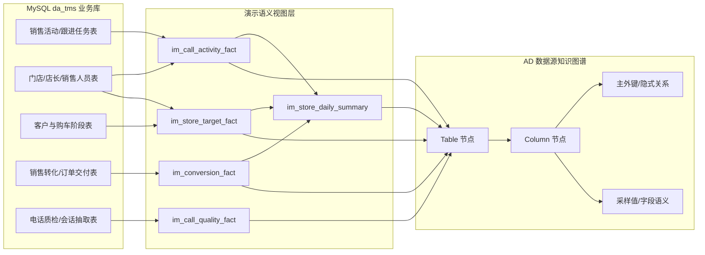
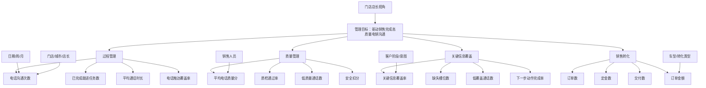

# da_tms 门店店长电销管理知识图谱演示说明

## 1. 演示目标

本演示基于本地 MySQL 数据库 `da_tms`，面向门店店长构建一个“每日销售电话沟通管理驾驶舱”。目标不是单纯展示报表，而是把业务库中的销售、客户、跟进、质检和转化数据沉淀为数据图谱、业务图谱、语义指标、Ad-Hoc 分析、监控预警和看板。

店长可以围绕四个问题管理团队：

- 今天电话沟通量是否达标，哪些门店和销售人员低于预期。
- 目标客户库存、跟进任务和销售转化是否符合计划。
- 每个销售人员的电话质量、质检通过率、下一步动作完成率如何。
- 每通电话是否覆盖试驾、预算、车型、价格、下一步动作等关键沟通要点。

## 2. 数据准备

本地 `da_tms` 中新增了 5 个只读语义视图，不修改原始业务表：

| 视图 | 作用 | 验证行数 |
| --- | --- | ---: |
| `im_call_activity_fact` | 电话/跟进活动事实，承载电话沟通量、任务状态、时长等过程指标 | 89,980 |
| `im_store_target_fact` | 门店目标与客户库存事实，承载目标客户数、库存客户数、目标缺口 | 20,000 |
| `im_conversion_fact` | 销售转化事实，承载订单、定金、交付、金额等结果指标 | 1,420 |
| `im_call_quality_fact` | 电话质检事实，承载质量分、质检通过、槽位覆盖、下一步动作 | 1,910 |
| `im_store_daily_summary` | 店长看板日粒度汇总事实，承载门店日趋势和目标完成 | 616 |

说明：`celn%` 演示表已按 `call_record_judgement_results.latest_conversation_time` 对齐到 2026-06-19 至 2026-07-02 的演示窗口；`celn_store`、`celn_product_expert`、客户、跟进、转化和目标数据已按 `shandong_emp_bind_store` 对齐到 44 个山东真实门店和 210 个真实专家。`call_record_judgement_results`、`call_record_judgement_rules`、`shandong_emp_bind_store` 三张受保护表未修改。

## 3. 技术图谱

已生成技术/数据源图谱：

- 当前技术图谱：`apps/ad/output/kg_20260706_003.ttl`
- 激活副本：`apps/ad/output/kg.ttl`
- 专项副本：`apps/ad/output/da_tms_kg.ttl`
- 三元组数量：42,492

## 4. 业务图谱

已生成业务知识图谱：

- 当前业务图谱：`apps/ad/output/business_kg/indicator-data.ttl`
- 演示归档：`apps/ad/output/business_kg/indicator-data-da-tms-store-manager.ttl`
- 推理图谱：`apps/ad/output/business_kg/indicator-inferred.ttl`
- 基础三元组：2,575
- 推理三元组：1,889
- 实体规模：25 个基础指标、18 个维度、5 个事实表、146 个字段、5 个分类

## 5. 指标体系

### 过程指标

- `MEAS_phone_call_count`：电话沟通次数
- `MEAS_follow_up_count`：跟进次数
- `MEAS_completed_task_count`：已完成跟进任务数
- `MEAS_pending_task_count`：待处理跟进任务数
- `MEAS_total_duration_seconds`：总通话时长
- `MEAS_call_duration_avg`：平均通话时长

### 目标完成指标

- `MEAS_target_customer_count`：目标客户数
- `MEAS_inventory_customer_count`：客户库存数
- `MEAS_target_gap_count`：目标缺口
- `MEAS_phone_contact_rate`：电话触达覆盖率，公式指标
- `MEAS_inventory_completion_rate`：目标库存完成率，公式指标

### 电话质量与覆盖指标

- `MEAS_avg_call_quality_score`：平均电话质量分
- `MEAS_quality_record_count`：质检通话数
- `MEAS_pass_call_count`：质检通过通话数
- `MEAS_call_quality_pass_rate`：质检通过率，公式指标
- `MEAS_avg_slot_coverage_rate`：平均关键信息覆盖率
- `MEAS_slot_coverage_pct`：关键信息覆盖率，公式指标
- `MEAS_missing_slot_count`：缺失槽位数
- `MEAS_low_coverage_call_count`：低覆盖通话数
- `MEAS_low_quality_call_count`：低质量通话数
- `MEAS_next_action_completion_rate`：下一步动作完成率，公式指标

### 转化指标

- `MEAS_order_count`：订单数
- `MEAS_deposit_count`：定金数
- `MEAS_delivery_count`：交付数
- `MEAS_conversion_order_amount`：转化订单金额

## 6. Ad-Hoc 与看板

已生成 13 个 Ad-Hoc 组件，均以 `da_tms_` 开头：

- KPI：电话沟通次数、目标库存完成率、平均电话质量分、关键信息覆盖率
- 趋势：日电话沟通趋势
- 排名：门店电话沟通排行、销售电话沟通排行、销售人员质量分排行
- 诊断：目标缺口表、客户意图覆盖率、低覆盖热力图、门店转化金额
- 工作台：低质检/低覆盖电话追踪清单

已生成看板：

- 看板 ID：`dash_da_tms_store_manager_sales_call`
- 看板名称：`门店店长电销管理驾驶舱`
- 入口：`http://localhost:8080/dashboard/view/dash_da_tms_store_manager_sales_call`

看板推荐讲解顺序：

1. 顶部 KPI：电话量、目标完成、平均质量分、关键信息覆盖率。
2. 日趋势：确认最近日期的电话沟通节奏，按日期下钻到门店和销售人员。
3. 目标缺口：找出目标客户库存缺口最大的门店。
4. 销售人员质量分析：对比电话质量分、低覆盖通话和下一步动作完成情况。
5. 客户意图覆盖：识别不同意图场景中销售是否覆盖关键沟通信息。
6. 工作清单：把低质量、低覆盖电话转为店长复盘和辅导动作。

## 7. 监控预警

已在本地 `da_tms.alert_rule` 写入 4 条店长电销规则：

| 规则 | 指标 | 条件 | 严重度 |
| --- | --- | --- | --- |
| 门店电销｜平均电话质量分低于 60 | `MEAS_avg_call_quality_score` | `<= 60` | critical |
| 门店电销｜关键信息覆盖率低于 60% | `MEAS_slot_coverage_pct` | `<= 60` | critical |
| 门店电销｜目标缺口扩大 | `MEAS_target_gap_count` | `<= -100` | warning |
| 门店电销｜低覆盖通话需追踪 | `MEAS_low_coverage_call_count` | `>= 1` | warning |

验证结果：按客户意图查询 `ad.slot_coverage_pct` 时，系统返回 7 条严重预警，命中“关键信息覆盖率低于 60%”规则。

## 8. 演示话术

1. “这个系统先从本地 `da_tms` 业务库生成数据源知识图谱，自动识别表、字段、主外键和隐式关系。”
2. “在业务图谱层，我们把店长关心的问题抽象成指标、维度、事实表和指标应用关系，而不是写死在单张报表里。”
3. “店长先看电话沟通量和目标完成，再看电话质量和关键要点覆盖率。如果覆盖率偏低，系统会直接在查询结果和看板组件上打出预警。”
4. “Ad-Hoc 允许临时切维度，比如从日期切到门店、从门店切到销售人员、从销售人员切到客户意图。”
5. “最后进入工作清单，把低质量或低覆盖电话作为复盘任务，指导销售补足沟通动作。”

## 9. 接口验证快照

- `/api/business-kg/stats`：25 个指标、18 个维度、5 个事实表、2,575 个基础三元组。
- `/api/ad/v1/meta`：30 个语义指标、15 个普通维度、3 个时间维度，其中 5 个为公式指标。
- `/api/ad/v1/load` 查询 `ad.phone_call_count` 按 `ad.date_day` 分组：2026-06-19 至 2026-07-02 共 14 天，每天覆盖 44 个门店。
- `/api/ad/v1/load` 查询 `ad.phone_call_count`：27,057。
- `/api/ad/v1/load` 查询 `ad.inventory_completion_rate`：89.16%。
- `/api/ad/v1/load` 查询 `ad.call_quality_pass_rate`：14.29%。
- `/api/ad/v1/load` 查询 `ad.slot_coverage_pct` 按 `ad.intent` 分组：返回 7 条严重预警。
- 数据调整前备份：`backups/da_tms_celn_before_align_20260706_101417.sql`。
